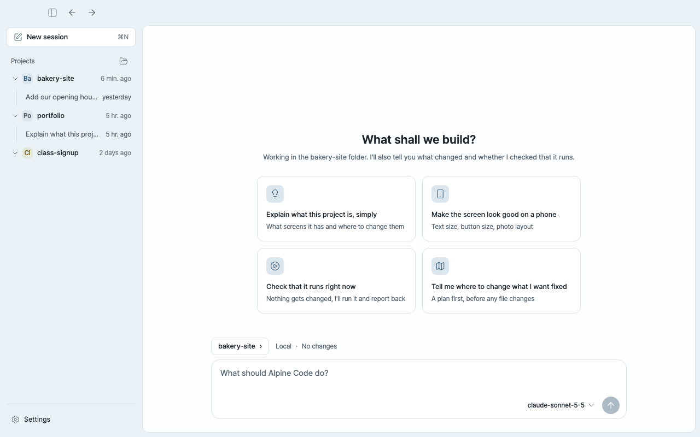
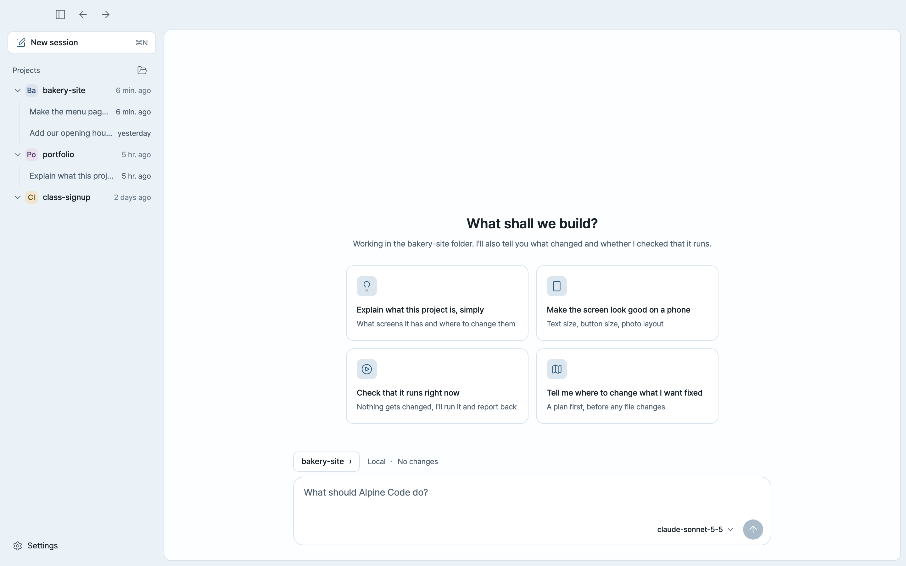
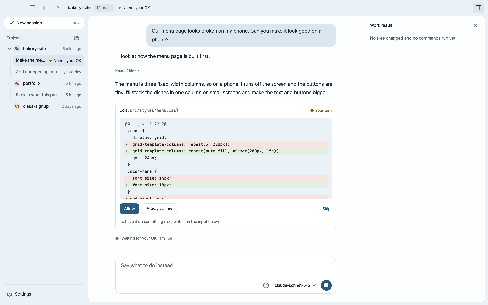
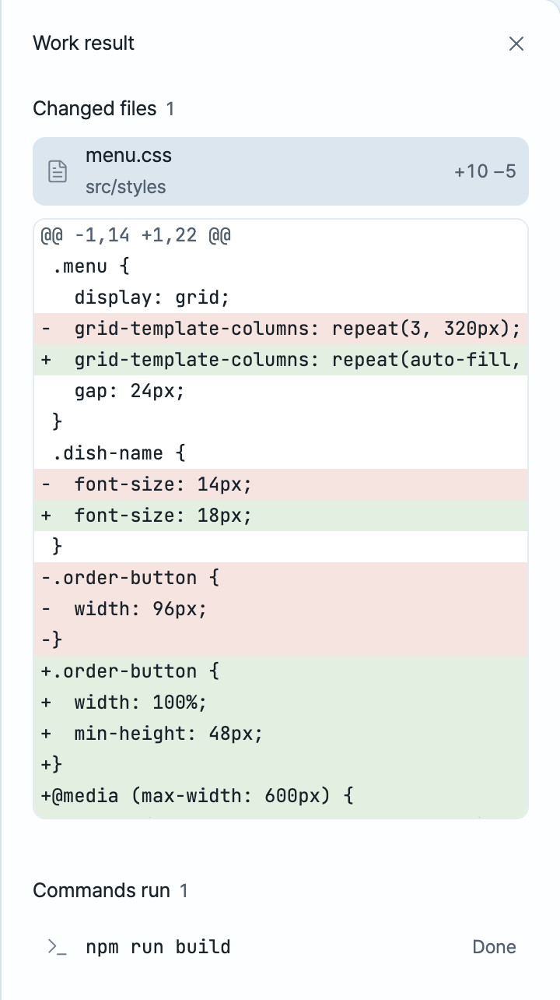
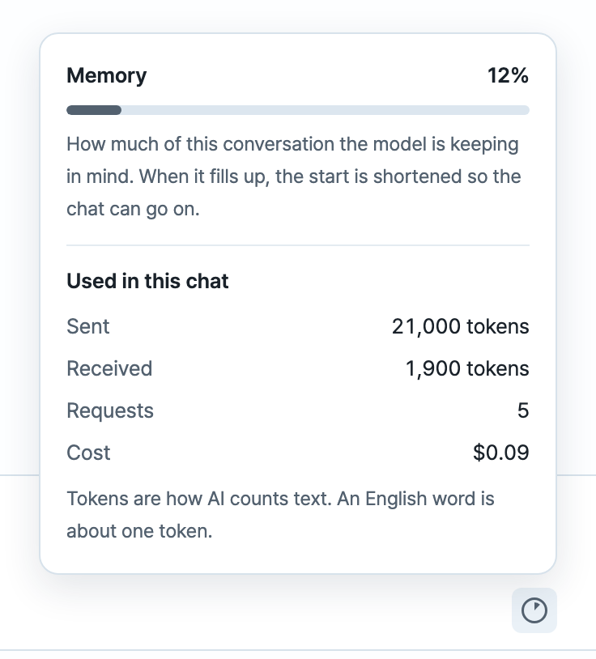
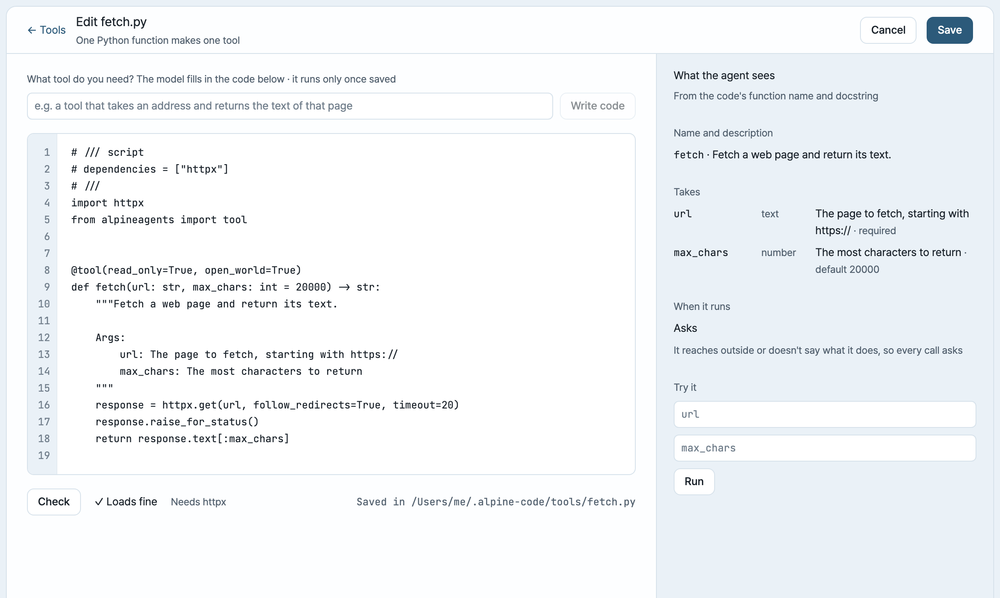
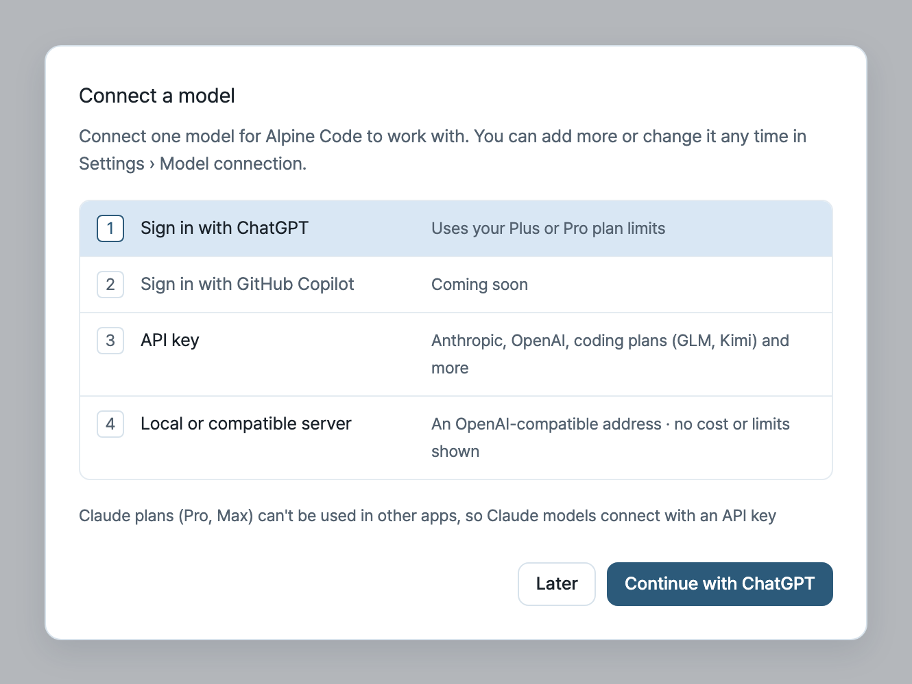

<h1 align="center">Alpine Code</h1>

<p align="center">
  <b>An open-source coding agent that's easy for people who don't code,<br>and open all the way down to its tools for people who do.</b>
</p>

<p align="center">
  <a href="https://github.com/TGoddessana/alpine-code/releases/latest"><b>Download for Mac</b></a>
  &nbsp;·&nbsp;
  <a href="#in-the-terminal">Terminal version</a>
  &nbsp;·&nbsp;
  <a href="LICENSE">MIT license</a>
</p>

<p align="center">
  
</p>

Alpine Code is an open-source AI coding agent for your desktop and your terminal. Open a folder, say what you want,
and it reads the files, makes the changes and checks that they work.

It's built for two kinds of people at once:

- **If you don't code**, it talks in plain words, asks before it changes anything and shows you everything it did.
- **If you do**, every part of it is yours to change: bring any model, write your own tools in Python, choose which
  tools each project gets, or build on the agent core.

## Open source

- **MIT licensed.** The agent, the desktop app and the terminal app are all in this repository. Read it, fork it,
  change it.
- **Any model.** Use your ChatGPT plan, an API key, or a model running on your own machine. Nothing ties you to one
  provider.
- **No account, no server of ours.** What you ask goes straight from your computer to the model you connected, and
  Alpine Code sends us nothing. API keys stay on your computer, in `~/.alpine-code`, readable only by you.
- **Your files stay where they are.** It works on your own folders, not a copy in the cloud, and keeps your
  conversations on your computer.

## Friendly if you don't code

**Ask the way you'd ask a person.** "Make the menu page look good on a phone." "Explain what this project is,
simply." "Check that it still runs." Not sure where to start? A new session suggests a few things to try.

<p align="center">
  
</p>

**Nothing changes without your OK.** It reads freely inside the folder you opened. Before it changes a file or runs a
command, it shows you what it wants to do and waits: **Allow**, **Always allow**, or **Skip** and tell it what to do
instead. A project that needs you is marked in the list, so you can leave it working and come back.

<p align="center">
  
</p>

**You see everything it did.** The work result panel lists every file it changed, line by line, and every command it
ran. When it's done, it tells you what changed and whether it checked that it works.

**No word left unexplained.** Where a technical word can't be avoided, Alpine Code says what it means. Click the
memory meter to see how much of the conversation the model is keeping in mind, and what the chat has cost so far.

<table>
  <tr>
    <td width="50%" valign="top"></td>
    <td width="50%" valign="top"></td>
  </tr>
  <tr>
    <td align="center">Every change, line by line</td>
    <td align="center">Memory and cost, in plain words</td>
  </tr>
</table>

## Hackable if you do

**Write your own tools.** A tool is one Python function: its name, type hints and docstring are what the agent sees.
List the packages it needs in the file ([inline script metadata](https://peps.python.org/pep-0723/)) and they're
installed for you, after asking for any it hasn't reviewed. Or describe the tool in a sentence and let the model write it. **Check** shows exactly what the
agent will see, and **Try it** runs it before you save.

<p align="center">
  
</p>


**Choose the tools for each job.** Tool profiles pick which tools are on for a project, a model, or both. Give a
small local model a light set and a big project everything.

**Tell it how your project works.** An `AGENTS.md` (or `CLAUDE.md`) file in the folder is read before every session,
so you write your conventions down once.

**Bring any model.** Besides the providers it knows, any server that speaks the OpenAI API works, local or hosted.

**Build on the core.** The agent is its own Python package, `alpine-code-core`, with no UI in it. The desktop app
talks to it over a JSON-RPC protocol ([docs/session-protocol.md](docs/session-protocol.md)), so another front end
is one more client. [CONTRIBUTING.md](CONTRIBUTING.md) shows how the repository fits together.

## Get started

1. **Download** Alpine Code from the [latest release](https://github.com/TGoddessana/alpine-code/releases/latest)
   (the `.dmg` file), open it and drag Alpine Code into Applications.
2. **Connect a model.** Alpine Code asks the first time you open it.
3. **Open a folder** and say what you'd like to do.

Alpine Code runs on Macs with Apple silicon (M1 or later) and macOS 11 or later. It updates itself: a new version
downloads in the background and is installed when you quit. Windows is coming.

### Connect a model

- **Your ChatGPT plan.** Sign in with ChatGPT to use your Plus or Pro plan. No API key, no separate bill.
- **An API key** from Anthropic (Claude), OpenAI, Google Gemini or OpenRouter, billed by what you use. Coding plans
  work too: GLM Coding Plan, Kimi For Coding and MiniMax Coding Plan.
- **A model on your own computer** through Ollama, LM Studio or vLLM. Free, and nothing leaves your machine.

You can connect several and switch models in the middle of a conversation without losing it. Claude's Pro and Max
plans can't be used in other apps, so Claude models connect with an API key.

<p align="center">
  
</p>

## In the terminal

The same agent runs in a terminal. With [uv](https://docs.astral.sh/uv/):

```sh
uv tool install alpine-code
alpine                                    # interactive
git diff | alpine -p "review this diff"   # print the answer and exit, for scripts and CI
```

Keys, commands, permissions and settings are in the [terminal guide](apps/cli/README.md). The terminal and the
desktop app share their model connections.

## Contributing

Bug reports, ideas and pull requests are welcome: [open an issue](https://github.com/TGoddessana/alpine-code/issues)
or start with [CONTRIBUTING.md](CONTRIBUTING.md). Alpine Code is built on
[alpineagents](https://tgoddessana.github.io/alpineagents/) and released under the [MIT license](LICENSE).
